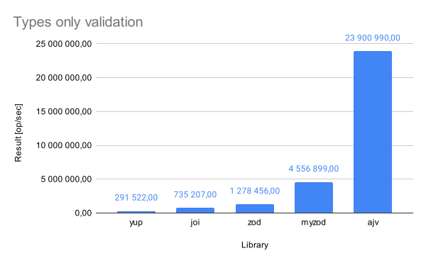
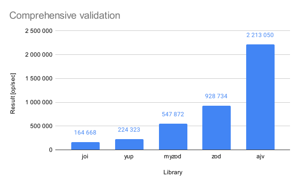
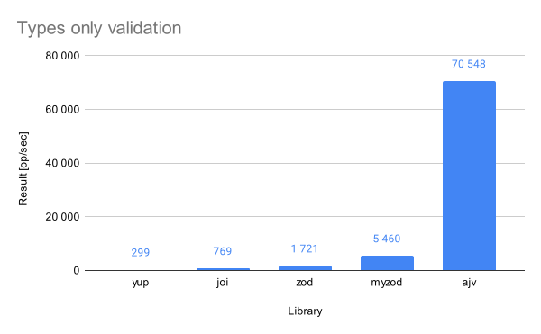
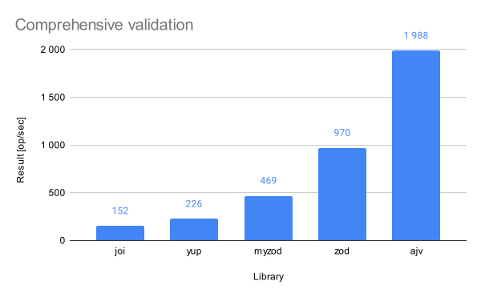

# Validators benchmark
It is crucial to verify that the user's input matches the business requirements. Validating input data is one of the most common tasks that all software performs in the background.
During my career, I've worked with multiple libraries, all of which serve a similar purpose: validate if input matches the required criteria.  
A few years ago, I worked on a project that used a library called myzod. I knew zod by that time, but I had never heard of myzod. I looked it up on npmjs and GitHub. It was a small library, with only one person maintaining it. It had over 100 stars and thousands of downloads every month. I was surprised that this library was chosen because other options seemed more popular and stable. I've asked the team members why they picked this particular library — it's for performance, they said. Author of myzod states that their solution is about 25 times faster than zod and 6 times faster than Joi. Those validators were benchmarked on Node 13. As of today (December 2023), Node 20 is the latest LTS version of Node.js. Zod and Joi are being actively developed while myzod seems to be less maintained. I've decided to perform my own benchmarks to check if myzod is still a faster option.

## Tested libraries
* [ajv](https://www.npmjs.com/package/ajv/v/8.12.0) (with [ajv-formats](https://www.npmjs.com/package/ajv-formats/v/2.1.1))
* [joi](https://www.npmjs.com/package/joi/v/17.11.0)
* [yup](https://www.npmjs.com/package/yup/v/1.3.2)
* [zod](https://www.npmjs.com/package/zod/v/3.22.4)
* [myzod](https://www.npmjs.com/package/myzod/v/1.11.0) (with [validator](https://www.npmjs.com/package/validator/v/13.11.0))

## Benchmark implementation
Two variants were checked:
1. Validating only the object structure without verifying the actual content (similar to the benchmarks implemented by the myzod team).
2. All actual content is checked against the provided criteria in a more realistic example.

All of the benchmarks were done on a 2023 MacBook Pro with the Apple M3 Chip using Node 20.10.0 and a tool made by Paolo Insogna, [Cronometro](https://www.npmjs.com/package/cronometro/v/1.2.0).
The implementation can be found in the [GitHub repository](https://github.com/mikolajkalwa/nodejs-validator-benchmark).

### Tested object
```js
export const user = {
  name: {
    first: 'John',
    last: 'Doe'
  },
  login: {
    email: 'john.doe@example.com',
    password: 'dcJERRB28hApdfX3puKHkNaEp2KxMa'
  },
  organization_id: 'e923adb7-67e4-428e-98b5-0799c6e93c6f',
  requested_at: '2023-11-18T19:05:46.760Z'
}
```
In a `types only` scenario, only the object structure is checked and all the end fields need to be of type `string`.
In `comprehensive validation` scenario, it is additionally checked if: 
* `first` name length is between 1 and 999 characters,
* `last` name length is between 1 and 999 characters,
* `email` contains valid email address,
* `password` length is between 12 and 50 characters,
* `organization_id` included valid UUID,
* `requested_at` contains date time string satisfying ISO 8601 norm. 

### Notes on some of the tested libraries
* myzod does not have refined string validation built-in: "Myzod is not interested in reimplementing all possible string validations, i.e. isUUID, isEmail, isAlphaNumeric, etc. The myzod string validation can be easily extended via the `withPredicate` API". Implemented benchmarks use [validator](https://www.npmjs.com/package/validator) library because it is used in myzod examples. 
* yup was not able to correctly validate value of `requested_at` field out of the box . When using `yup.date` method, yup tries to perform the validation by passing the input into the `Date` constructor. It results in a faulty validation. For example, string of value: `"1"` is transformed to Date object `2000-12-31T23:00:00.000Z`. Trying to resolve this behaviuour by enabling strict validation (which disables the casting) results in failed validation in case of string fullfiling the requierements of ISO 8601 norm. In order to properly validate content of `requested_at` I decided to combine `yup.string` with `isISO8601` from `validator` library.

## Results
Cronometro outputs summarized test results in a table. More details can be obtained from the results object using the API. Benchmark included 10 000 000 samples and the results were stable.

### Types only validation

| **Library**      | **Result**        | **Tolerance** | **Difference with slowest** |
|------------------|-------------------|---------------|-----------------------------|
| yup              | 291 522 op/sec    | ± 0.02 %      |                             |
| joi              | 735 207 op/sec    | ± 0.04 %      | + 152.20 %                  |
| zod              | 1 278 456 op/sec  | ± 0.04 %      | + 338.54 %                  |
| myzod            | 4 556 899 op/sec  | ± 0.01 %      | + 1463.14 %                 |
| ajv              | 23 900 990 op/sec | ± 0.15 %      | + 8098.68 %                 |




### Comprehensive validation

| **Library**      | **Result**       | **Tolerance** | **Difference with slowest** |
|------------------|------------------|---------------|-----------------------------|
| joi              | 164 668 op/sec   | ± 0.01 %      |                             |
| yup              | 224 323 op/sec   | ± 0.02 %      | + 36.23 %                   |
| myzod            | 547 872 op/sec   | ± 0.02 %      | + 232.71 %                  |
| zod              | 928 734 op/sec   | ± 0.03 %      | + 464.00 %                  |
| ajv              | 2 213 050 op/sec | ± 0.04 %      | + 1243.95 %                 |



In case of only validating the object structure, myzod is about 6 times faster than Joi and almost 3.5 times faster than zod. However, in case of comprehensive validation, myzod is 4 times faster than Joi and almost 2 times slower than zod. I understand that the performance of the validator library greatly influenced the results of this test, but as I mentioned earlier, myzod does not include sophisticated validation methods out of the box.  
Ajv turned to be the fastest to validate object structure, it's 5 times faster than myzod, and 18 times faster than zod. In the case of comprehensive content validation, Ajv is over 2 times faster than zod.

## Additional round of benchmarking
After performing those benchmarks I've decided to perform additional test, in which instead of performing 10 000 000 validation round on the same object, I've performed 10 000 iterations on 1 000 objects. Object were generated using [faker library](https://www.npmjs.com/package/@faker-js/faker/v/8.3.1), they had the same structure as the original object.
```js
const users = []

for (let i = 0; i < 1000; i++) {
  users.push({
    name: {
      first: faker.person.firstName(),
      last: faker.person.lastName()
    },
    login: {
      email: faker.internet.email(),
      password: faker.internet.password({ length: getRandomInt(12, 50) })
    },
    organization_id: faker.string.uuid(),
    requested_at: faker.date.anytime().toISOString()
  })
}
```
## Results
Results are seems to correspond to the previous test - with the exception of Ajv. In case of validating only the object structure (without the actual content) it performed better. In the first benchmark it took Ajv on avarage 42ns to validate an object. In this scenario Ajv needed 14175ns to validate 1 000 objects. It 14 ns per object, about 4 times faster than in the previous case.
### Types only validation

| **Slower tests** | **Result**    | **Tolerance** | **Difference with slowest** |
|------------------|---------------|---------------|-----------------------------|
| yup              | 299 op/sec    | ± 0.01 %      |                             |
| joi              | 769 op/sec    | ± 0.03 %      | + 157.05 %                  |
| zod              | 1 721 op/sec  | ± 0.05 %      | + 475.23 %                  |
| myzod            | 5 460 op/sec  | ± 0.05 %      | + 1725.14 %                 |
| ajv              | 70 548 op/sec | ± 0.32 %      | + 23480.25 %                |




### Comprehensive validation

| **Slower tests** | **Result**  | **Tolerance** | **Difference with slowest** |
|------------------|-------------|---------------|-----------------------------|
| joi              | 152 op/sec  | ± 0.01 %      |                             |
| yup              | 226 op/sec  | ± 0.01 %      | + 49.03 %                   |
| myzod            | 469 op/sec  | ± 0.02 %      | + 209.19 %                  |
| zod              | 970 op/sec  | ± 0.03 %      | + 539.62 %                  |
| ajv              | 1988 op/sec | ± 0.04 %      | + 1210.65 %                 |




## Final conclusions
Benchmarks presented in library documentation can be conducted incorreclty, bacome ouf of date, or present only specific scenariach in which presented solution appear to be better than other. They should not be the only factor when it comes to choosing which solution use in a project. 
Results mentioned in the myzod documentation don't meet reality. As of today (November 2023), myzod is only 3 to 4 times faster than zod when validating object structure only. When it comes to the actual validation, myzod (with validator) was slower than zod itself. These results suggest that zod got a lot faster over the last 3 years (results mentioned in myzod repo were added there in April 2020). 
In my opionion choosing the fastest option is not always a valid approach. Frequent updates, active community and developer experience are major factors as well, especially in a product that keeps evolving. When the development slows down, and product functionalities are considered stable, there comes the time for the performance optimizations. When it comes to choosing validator library for the project, if it has to handle as much traffic as possible, I would recommend using Ajv. In other cases, Zod is my favorite solution because it works well with the Typescript ecosystem.
