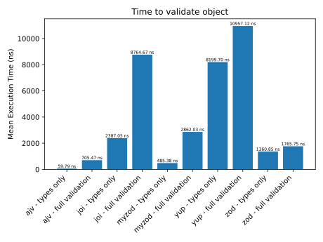

# Validators benchmark

### Intro
Validating user input is one of the most common actions that all systems do behind scenes. Verifying if user's provided input matches the business requirements is crucial to ensure correct operations of given software. 
During my career I've been working with multiple libraries - all serve similar purpose - validate if input date matches requiered critiera. 
Few years ago I participated in a project which was using library called myzod. By that time I already knew zod, but I have never heard of myzod. I've quickly looked it up on npmjs and github. This was one of the niche libraries with only one active maintener, with a littlve over 100 stars and couple thousands of download monthly. The choice of this library surprised me, as alternatives seemed to be more popular and stable. I've asked team members what were the reasons for choosing this particular library - performance they said. In the readme file myzod authors states that their solution is about 25 times faster than zod and 6 times faster than Joi (benchamarks were performed on Node 13). 
As of today (November 2023) Node 20, is the LTS version, zod and joi are being actively developed when myzod seems to be not, I've decided to perform my own benchmarks to check if myzod is really that much faster. 

### Tested libraries
* [ajv](https://www.npmjs.com/package/ajv/v/8.12.0) (with [ajv-formats](https://www.npmjs.com/package/ajv-formats/v/2.1.1))
* [joi](https://www.npmjs.com/package/joi/v/17.11.0)
* [yup](https://www.npmjs.com/package/yup/v/1.3.2)
* [zod](https://www.npmjs.com/package/zod/v/3.22.4)
* [myzod](https://www.npmjs.com/package/myzod/v/1.10.2) (with [validator](https://www.npmjs.com/package/validator/v/13.11.0))

One note on myzod library - myzod itself doesn't have refined string validations builtin. Accordint to the authors: "Myzod is not interested in reimplementing all possible string validations, ie isUUID, isEmail, isAlphaNumeric, etc. The myzod string validation can be easily extended via the withPredicate API.". In examples they use https://www.npmjs.com/package/validator, thus this library is used in the implemented benchamarks.

### Benchmark implementation
I've decided to check two variants:
1. Validating only the object structure without validation of the actual content (similar to benchrmarks implemented by myzod team).
2. A bit more realistic example in which all actual content is checked agains provided criteria.

For the benchmarks, I've decided to use a tool created by Paolo Insogna - cronometro. https://github.com/ShogunPanda/cronometro

#### Tested object
```js
export const user = {
  name: {
    first: 'John',
    last: 'Doe'
  },
  login: {
    email: 'john.doe@example.com',
    password: 'dcJERRB28hApdfX3puKHkNaEp2KxMa'
  },
  organization_id: 'e923adb7-67e4-428e-98b5-0799c6e93c6f',
  requested_at: '2023-11-18T19:05:46.760Z'
}
```
In `types only` scenario, only object structure is checked (all properties are requiered) + all of the end fields needs to be of type `string`.  
In `full validation` scenario it is additionaly checked if: 
* `first` name length is between 1 and 999 characters,
* `last` name length is between 1 and 999 characters,
* `email` contains valid email address,
* `password` length is between 12 and 50 charcters,
* `organization_id` included valid UUID,
* `requested_at` contains datetime satisfying ISO 8601 norm. 

All benchmarks were performed on MacBook Pro, using Node 20.9.0.  
Implementation can be found in [Github Repository](https://github.com/mikolajkalwa/nodejs-validator-benchmark). 


### Results
Cronometro outputs summarized tests results in a table. More details can be obtained from the results object using the API. Since the benchmark included 1 000 000 samples and results were quite stable (worst case tolerance was ± 0.57 %), I'll focus on average time needed to validate an object.

| **Slower tests**        | **Samples** | **Result**         | **Tolerance** |
|-------------------------|-------------|--------------------|---------------|
| yup - full validation   | 1000000     | 191264.88 op/sec   | ± 0.06 %      |
| joi - full validation   | 1000000     | 114094.37 op/sec   | ± 0.03 %      |
| yup - types only        | 1000000     | 121955.75 op/sec   | ± 0.07 %      |
| myzod - full validation | 1000000     | 349402.00 op/sec   | ± 0.05 %      |
| joi - types only        | 1000000     | 418926.55 op/sec   | ± 0.10 %      |
| zod - full validation   | 1000000     | 566331.74 op/sec   | ± 0.10 %      |
| zod - types only        | 1000000     | 734834.53 op/sec   | ± 0.12 %      |
| ajv - full validation   | 1000000     | 1417494.11 op/sec  | ± 0.12 %      |
| myzod - types only      | 1000000     | 2060232.36 op/sec  | ± 0.07 %      |
| **Fastest test**        | **Samples** | **Result**         | **Tolerance** |
| ajv - types only        | 1000000     | 16725654.71 op/sec | ± 0.57 %      |


