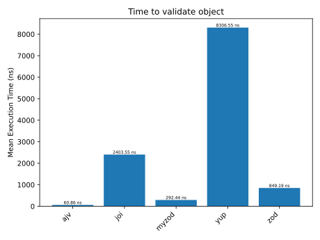
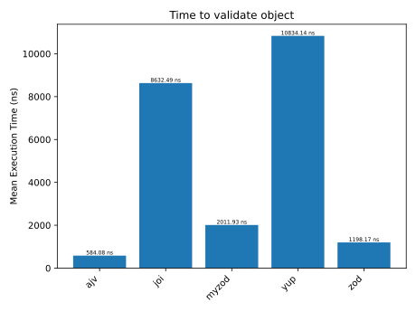

# Validators benchmark

### Intro
Validating user input is one of the most common actions that all systems do behind the scenes. Verifying if user's provided input matches the business requirements is crucial to ensure correct operations of given software. 
During my career, I've been working with multiple libraries - all serve a similar purpose - validate if input date matches required criteria. 
A few years ago, I participated in a project which was using a library called myzod. By that time, I already knew zod, but I had never heard of myzod. I've quickly looked it up on npmjs and GitHub. This was one of the niche libraries with only one active maintainer, with a little over 100 stars and a couple of thousands of downloads monthly. The choice of this library surprised me, as alternatives seemed to be more popular and stable. I've asked team members what were the reasons for choosing this particular library - performance, they said. In the readme file, myzod authors states that their solution is about 25 times faster than zod and 6 times faster than Joi (benchmarks were performed on Node 13). 
As of today (November 2023) Node 20, is the LTS version, zod and joi are being actively developed when myzod seems to be not, I've decided to perform my own benchmarks to check if myzod is really that much faster. 

### Tested libraries
* [ajv](https://www.npmjs.com/package/ajv/v/8.12.0) (with [ajv-formats](https://www.npmjs.com/package/ajv-formats/v/2.1.1))
* [joi](https://www.npmjs.com/package/joi/v/17.11.0)
* [yup](https://www.npmjs.com/package/yup/v/1.3.2)
* [zod](https://www.npmjs.com/package/zod/v/3.22.4)
* [myzod](https://www.npmjs.com/package/myzod/v/1.10.2) (with [validator](https://www.npmjs.com/package/validator/v/13.11.0))

One note on myzod library - it doesn't have refined string validations built-in. According to the authors: "Myzod is not interested in reimplementing all possible string validations, i.e. isUUID, isEmail, isAlphaNumeric, etc. The myzod string validation can be easily extended via the withPredicate API.". In examples, they use https://www.npmjs.com/package/validator, thus this library is used in the implemented benchmarks.

### Benchmark implementation
I've decided to check two variants:
1. Validating only the object structure without validation of the actual content (similar to benchmarks implemented by myzod team).
2. A bit more realistic example in which all actual content is checked against provided criteria.

For the benchmarks, I've decided to use a tool created by Paolo Insogna - cronometro. https://github.com/ShogunPanda/cronometro

#### Tested object
```js
export const user = {
  name: {
    first: 'John',
    last: 'Doe'
  },
  login: {
    email: 'john.doe@example.com',
    password: 'dcJERRB28hApdfX3puKHkNaEp2KxMa'
  },
  organization_id: 'e923adb7-67e4-428e-98b5-0799c6e93c6f',
  requested_at: '2023-11-18T19:05:46.760Z'
}
```
In the `types only` scenario, only object structure is checked (all properties are required) + all the end fields need to be of type `string`.  
In `full validation` scenario, it is additionally checked if: 
* `first` name length is between 1 and 999 characters,
* `last` name length is between 1 and 999 characters,
* `email` contains valid email address,
* `password` length is between 12 and 50 characters,
* `organization_id` included valid UUID,
* `requested_at` contains date time satisfying ISO 8601 norm. 

All benchmarks were performed on a MacBook Pro, using Node 20.10.0. 
The implementation can be found in [GitHub Repository](https://github.com/mikolajkalwa/nodejs-validator-benchmark). 

### Results
Cronometro outputs summarized tests results in a table. More details can be obtained from the results object using the API. Since the benchmark included 10 000 000 samples and results were quite stable (worst-case tolerance was ± 0.14 %), I'll focus on the average time needed to validate an object.

#### Types only validation

| **Slower tests** | **Samples** | **Result**        | **Tolerance** |
|------------------|-------------|-------------------|---------------|
| yup              | 10000000    | 120386.86 op/sec  | ± 0.02 %      |
| joi              | 10000000    | 416051.57 op/sec  | ± 0.05 %      |
| zod              | 10000000    | 1177593.99 op/sec | ± 0.07 %      |
| myzod            | 10000000    | 3419450.10 op/sec | ± 0.02 %      |
| **Fastest test** | **Samples** | **Result**        | **Tolerance** |
| ajv              | 10000000    | 1712090.05 op/sec | ± 0.14 %      |



#### Full content validation

| **Slower tests** | **Samples** | **Result**        | **Tolerance** |
|------------------|-------------|-------------------|---------------|
| yup              | 10000000    | 92300.85 op/sec   | ± 0.02 %      |
| joi              | 10000000    | 115841.40 op/sec  | ± 0.01 %      |
| myzod            | 10000000    | 497036.08 op/sec  | ± 0.02 %      |
| zod              | 10000000    | 834602.92 op/sec  | ± 0.06 %      |
| **Fastest test** | **Samples** | **Result**        | **Tolerance** |
| ajv              | 10000000    | 1712090.05 op/sec | ± 0.06 %      |



In the case of only validating the object structure, myzod is about 8 times faster than Joi and almost 3 times faster than zod. However, in case of full validation, myzod is 4 times faster than Joi and about 2 times slower than zod. I know that in this case I've checked the performance of the validator library, not myzod itself, but as I mentioned earlier, myzod doesn't include sophisticated validation methods out of the box. The results may change if there's a faster alternative to the validator library.  
Ajv turned to be the fastest to validate object structure, it's almost 5 times faster than myzod, and over 14 times faster than zod. In the case of full content validation, Ajv is about 2 times faster than zod.

### Conclusions
Myzod is fast, however the results mentioned in the library readme doesn't meet the reality. Today (end of November 2023) myzod is only 3 times faster than zod when validation object structure only. When it comes to the actual validation, myzod with combination of validator was slower than zod itself. These results suggest that zod got a lof faster over the last 3 years (results mentioned in myzod repo were added there in April 2020). 
Should you use the fastest library? It depends... If your application needs to process thousands of requests per second, I'd use Ajv. In other cased zod is my preferred solution as it integrates very nicely with the Typescript ecosystem. Having types generated based on a validation schema helps to avoid unnecessary code duplication within a project. You only need to modify the object schema, and types are getting automatically changed as well.
